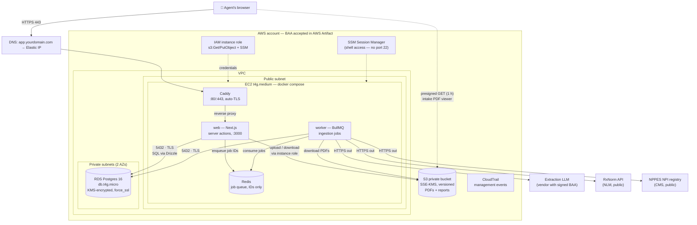
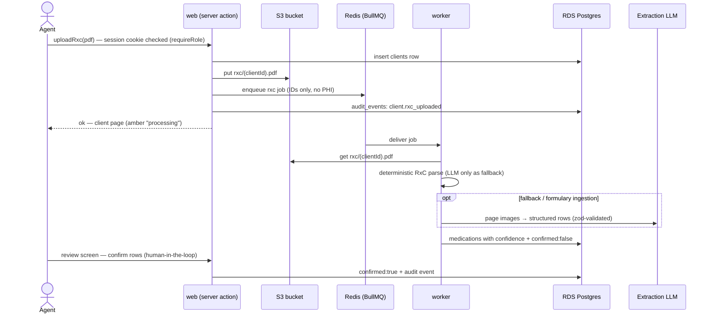
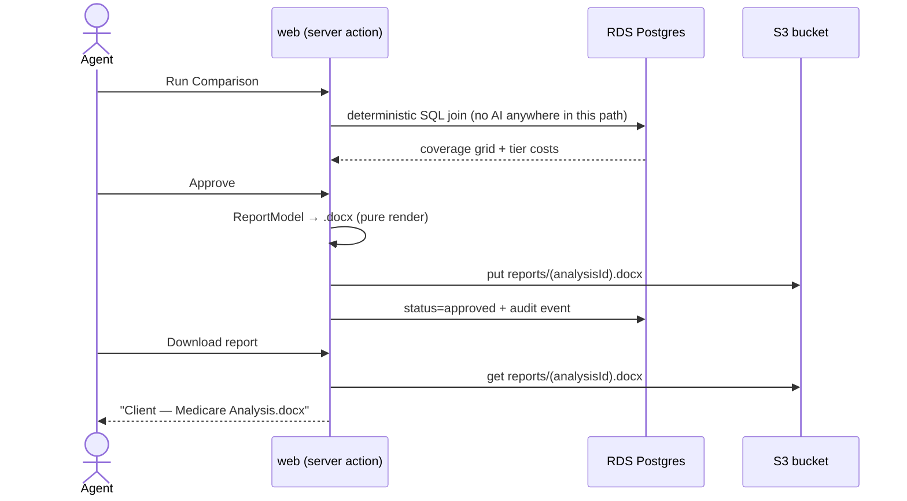

# AWS Architecture

Companion to [AWS_MIGRATION.md](AWS_MIGRATION.md). GitHub renders these
diagrams; locally use any Mermaid preview.

## The whole system

Key boundaries:

- **Only Caddy is reachable from the internet** (80/443). Web, worker, and
  Redis live on the compose-internal network; RDS accepts 5432 only from the
  EC2 security group and is not publicly accessible.
- **The browser never talks to Postgres or external APIs** — everything goes
  through Next.js server actions. The one direct browser→AWS path is the
  time-limited presigned S3 GET used to render a stored intake PDF.
- **The worker is the only component calling external APIs** (extraction LLM,
  RxNorm, NPPES) — outbound only, via the instance's public IP (no NAT).
- **No credentials on disk**: S3 access comes from the IAM instance role;
  shell access is SSM Session Manager, so no SSH port exists.

## Flow 1 — intake: agent uploads an Rx Collect PDF

## Flow 2 — analysis → approved Word report

## Who talks to whom

| From | To | Port / mechanism | Purpose |
|---|---|---|---|
| Browser | Caddy | 443 (TLS, HSTS) | the app |
| Browser | S3 | 443, presigned URL (1 h) | render stored intake PDF |
| Caddy | web | 3000, compose network | reverse proxy |
| web / worker | RDS | 5432, TLS enforced | all data (Drizzle) |
| web / worker | S3 | 443, instance role | PDFs + reports |
| web ↔ worker | Redis | 6379, compose network | job queue (IDs only) |
| worker | LLM / RxNorm / NPPES | 443 outbound | ingestion-time extraction + normalization |
| Operator | EC2 | SSM Session Manager | shell, deploys |

PHI lives in exactly three places: RDS (client + medication rows), S3 (source
PDFs, generated reports), and transiently at the extraction LLM during
ingestion — which is why that vendor needs its own BAA.
