# Database Schema — Entity Relationships

Source of truth: [`packages/db/src/schema.ts`](../packages/db/src/schema.ts) (Drizzle).
This diagram is generated by hand from that file — if you change the schema,
update this too.

The model has four domains:

1. **Reference data** — carriers, formularies, plans, tier costs (ingested).
2. **Pharmacies** — pharmacy directory + per-plan network status.
3. **Client intake** — clients and their medications / pharmacies / policies (PHI).
4. **Analysis** — the comparison an agent builds, its results, and the report.

```mermaid
erDiagram
  %% ─── Auth ────────────────────────────────────────────────
  profiles {
    uuid id PK
    text full_name
    enum role "agent|manager|admin"
  }

  %% ─── Reference data: carriers, formularies, plans ─────────
  carriers {
    uuid id PK
    text name
    text slug UK
  }
  formularies {
    uuid id PK
    uuid carrier_id FK
    int  plan_year
    text label
    enum status "ingesting|qa|active|superseded"
    uuid activated_by FK
  }
  formulary_entries {
    uuid id PK
    uuid formulary_id FK
    text raw_drug_name
    int  tier
    bool pa
    bool st
    uuid reviewed_by FK
  }
  formulary_legends {
    uuid id PK
    uuid formulary_id FK
    text code
    text definition
  }
  plans {
    uuid id PK
    uuid carrier_id FK
    uuid formulary_id FK "nullable"
    int  plan_year
    text name
    int  premium_cents
  }
  plan_service_areas {
    uuid id PK
    uuid plan_id FK
    text state
    text county
  }
  plan_tier_costs {
    uuid id PK
    uuid plan_id FK
    enum channel "pref/std retail, pref/std mail"
    enum tier "t1..t6|insulin"
    int  days_supply
    int  copay_cents
    uuid verified_by FK
  }

  %% ─── ZIP crosswalk ────────────────────────────────────────
  zip_counties {
    uuid id PK
    text zip
    text state
    text county
  }

  %% ─── Pharmacies ───────────────────────────────────────────
  pharmacies {
    uuid id PK
    text npi UK
    text name
    text zip
  }
  plan_pharmacy_networks {
    uuid id PK
    uuid plan_id FK
    uuid pharmacy_id FK
    enum status "preferred|standard|out_of_network"
    uuid verified_by FK
  }

  %% ─── Clients & intake (PHI) ───────────────────────────────
  clients {
    uuid id PK
    text full_name
    text zip
    uuid created_by FK
  }
  client_pharmacies {
    uuid id PK
    uuid client_id FK
    uuid pharmacy_id FK "nullable until matched"
    int  rank
    bool confirmed
  }
  client_medications {
    uuid id PK
    uuid client_id FK
    text name
    text rxcui
    bool confirmed
  }
  in_force_policies {
    uuid id PK
    uuid client_id FK
    uuid matched_plan_id FK "nullable"
    enum policy_type "pdp|ma_pd|med_supp|other"
    bool is_current_drug_plan
  }

  %% ─── Analysis ─────────────────────────────────────────────
  analyses {
    uuid id PK
    uuid client_id FK
    int  plan_year
    enum status "new|in_review|approved|delivered"
    bool include_mail_order
    uuid assigned_to FK
    uuid approved_by FK
    uuid created_by FK
  }
  analysis_plans {
    uuid id PK
    uuid analysis_id FK
    uuid plan_id FK
    bool is_current
    int  position
  }
  analysis_pharmacies {
    uuid id PK
    uuid analysis_id FK
    uuid pharmacy_id FK
    int  position
  }
  analysis_results {
    uuid id PK
    uuid analysis_id FK
    uuid medication_id FK
    uuid plan_id FK
    uuid matched_entry_id FK "nullable"
    enum coverage
    int  tier
  }
  report_overrides {
    uuid id PK
    uuid analysis_id FK
    text path
    jsonb value
    uuid edited_by FK
  }

  %% ─── Worker / audit (no enforced FK) ──────────────────────
  audit_events {
    uuid id PK
    uuid actor_id FK
    text action
    text entity_type
    uuid entity_id "soft ref"
  }
  ingestion_jobs {
    uuid id PK
    text kind
    text status
    uuid target_id "soft ref"
  }

  %% ─── Relationships ───────────────────────────────────────
  carriers            ||--o{ formularies            : issues
  carriers            ||--o{ plans                  : offers
  formularies         ||--o{ formulary_entries      : lists
  formularies         ||--o{ formulary_legends      : keys
  formularies         ||--o{ plans                  : "priced by"
  plans               ||--o{ plan_service_areas     : "covers"
  plans               ||--o{ plan_tier_costs        : "cost-shares"
  plans               ||--o{ plan_pharmacy_networks : "networks"
  pharmacies          ||--o{ plan_pharmacy_networks : "in-network on"

  clients             ||--o{ client_pharmacies      : uses
  pharmacies          ||--o{ client_pharmacies      : "matched to"
  clients             ||--o{ client_medications     : takes
  clients             ||--o{ in_force_policies      : holds
  plans               ||--o{ in_force_policies      : "matched as"

  clients             ||--o{ analyses               : "analyzed in"
  analyses            ||--o{ analysis_plans         : compares
  plans               ||--o{ analysis_plans         : "compared in"
  analyses            ||--o{ analysis_pharmacies    : "prices at"
  pharmacies          ||--o{ analysis_pharmacies    : "priced in"
  analyses            ||--o{ analysis_results       : yields
  client_medications  ||--o{ analysis_results       : "row of"
  plans               ||--o{ analysis_results       : "column of"
  formulary_entries   ||--o{ analysis_results       : "matched by"
  analyses            ||--o{ report_overrides        : "edited via"

  profiles            ||--o{ clients                : "created by"
  profiles            ||--o{ analyses               : "owns/approves"
  profiles            ||--o{ audit_events           : "acted by"
```



## The comparison core (how a report is built)

The three join tables under `analyses` are the heart of the product — a
comparison is a SQL join, never an LLM call:

- **`analysis_plans`** — which plans are the grid **columns** (3–5, one marked
  current).
- **`analysis_pharmacies`** — which pharmacies are the cost-matrix **rows**.
  Each is priced per plan at the channel resolved from
  `plan_pharmacy_networks.status` (preferred/standard retail); a plan's
  mail-order channel is added as an extra row via `analyses.include_mail_order`.
- **`analysis_results`** — one row per **medication × plan** cell: coverage,
  tier, restrictions, and provenance (`matched_entry_id` + `match_method`).
  Cost is *not* stored here — it is derived live from `plan_tier_costs` for the
  resolved channel, so the same coverage powers every pharmacy's price.

```
client_medications ─┐
                    ├─►  analysis_results  (med × plan coverage/tier)
plans ──────────────┘            │
                                 ▼
plan_tier_costs  ×  (channel resolved per plan × pharmacy)  ─►  cost matrix
       ▲                                   ▲
       │                                   │
   plans                    plan_pharmacy_networks + analysis_pharmacies
```

## Notes

- **`profiles` is referenced by more columns than drawn.** To keep the diagram
  legible only the primary ownership edges are shown; these columns also FK to
  `profiles`: `formularies.activated_by`, `formulary_entries.reviewed_by`,
  `plan_tier_costs.verified_by`, `plan_pharmacy_networks.verified_by`,
  `analyses.assigned_to` / `approved_by`, `report_overrides.edited_by`.
- **Soft references (no FK constraint):** `audit_events.entity_id` and
  `ingestion_jobs.target_id` point at whatever row the event/job concerns
  (`entity_type` / `kind` says which table). They are intentionally not enforced
  FKs so audit rows survive deletes and jobs can outlive their target.
- **Cascades:** deleting a `client`, `analysis`, `formulary`, or `plan` cascades
  to its dependent rows (medications, results, entries, tier costs, etc.).
  `analysis_pharmacies` cascades from both `analyses` and `pharmacies`.
- **Money** is always integer cents. **Plan-year** columns keep comparisons from
  ever crossing plan years silently.
